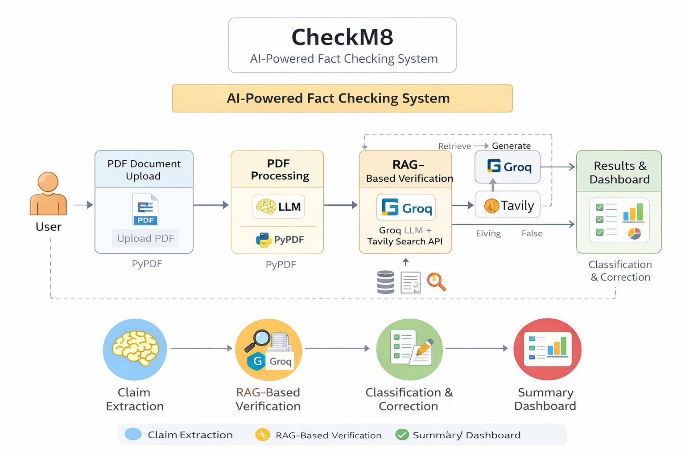

# ♟️ CheckM8 — AI-Powered Fact Checking Web App

CheckM8 is an AI-driven editorial fact-checking tool that verifies factual claims in documents before publication.  
It automatically extracts verifiable claims from PDFs, cross-checks them against live web data, and flags inaccurate or false information with corrected suggestions and sources.

---

## 🚀 Live Demo

🔗 **Live App:** https://checkm8.streamlit.app  
🔗 **GitHub Repo:** https://github.com/Raj14Aditya/CheckM8

---

## 🎯 Problem Statement

Writers and editors often publish documents containing:
- outdated statistics
- incorrect financial figures
- wrong technical specifications

Manual fact-checking is slow and error-prone.  
CheckM8 acts as a **pre-publish fact-checking layer** between content drafts and the publish button.

---

## 🏗️ System Architecture

The system follows a Retrieval-Augmented Generation (RAG) pipeline using live web data:



### 🔄 Pipeline Flow

1. **PDF Upload (Streamlit UI)**  
2. **Text Extraction (PyPDF)**  
3. **Claim Extraction (LLM via Groq)**  
4. **Live Evidence Retrieval (Tavily Search API)**  
5. **Claim Verification (LLM + Evidence)**  
6. **Verdict Classification**  
   - ✅ Verified  
   - ⚠️ Inaccurate (Outdated)  
   - ❌ False  
7. **Correction Suggestion + Source Links**  
8. **Executive Summary Dashboard**

---

## ✨ Key Features

- 📄 PDF-based document analysis  
- 🧠 AI-based claim extraction  
- 🌐 Live web verification using Tavily  
- ✅ Verified / ⚠️ Inaccurate / ❌ False classification  
- ✍️ Auto-correction suggestions for wrong claims  
- 📊 Executive summary dashboard  
- 🔗 Source citations for transparency  

---

## 🛠️ Tech Stack

- **Frontend:** Streamlit  
- **Backend:** Python  
- **LLM Inference:** Groq (LLaMA models)  
- **Web Search:** Tavily API  
- **PDF Parsing:** PyPDF  
- **Deployment:** Streamlit Cloud  

---

## ⚙️ Local Setup

### 1. Clone Repository

```bash
git clone https://github.com/Raj14Aditya/CheckM8.git
cd CheckM8
```

### 2. Create Virtual Environment (Windows)
```bash
python -m venv venv
venv\Scripts\activate
```

### 3. Create Virtual Environment (Mac/Linux)
```bash
python3 -m venv venv
source venv/bin/activate
```
### 4. Install Dependencies
```bash
pip install -r requirements.txt
```
### 5. Add API Keys
Create a file named .env in project root:
```bash
GROQ_API_KEY=your_groq_api_key_here
TAVILY_API_KEY=your_tavily_api_key_here
```
### 6. Run Application
```bash
streamlit run app.py
```
Open in browser:
```bash
http://localhost:8501
```

